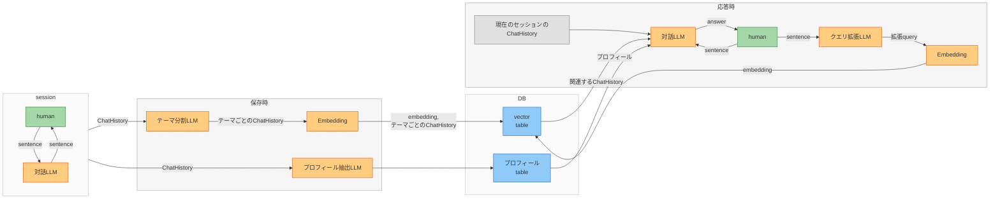

```mermaid
graph LR
  subgraph session
    human1[human] --sentence--> 対話LLM1[対話LLM] --sentence--> human1
  end

  subgraph 保存時
    テーマ分割LLM
    プロフィール抽出LLM
    テーマ分割LLM --テーマごとのChatHistory--> Embedding1[Embedding]
  end

  session --ChatHistory--> テーマ分割LLM
  session --ChatHistory--> プロフィール抽出LLM

  subgraph DB
    vectorDB["vector<br>table"]
    プロフィールDB["プロフィール<br>table"]
  end

  subgraph 応答時
    human2[human] --sentence--> 対話LLM2[対話LLM] --answer--> human2
    現在のセッションのChatHistory --> 対話LLM2
    human2 --sentence--> クエリ拡張LLM --拡張query--> Embedding2[Embedding]
  end

  Embedding1 --"embedding,<br>テーマごとのChatHistory"--> vectorDB
  プロフィール抽出LLM --> プロフィールDB
  Embedding2 --embedding--> vectorDB --関連するChatHistory--> 対話LLM2
  プロフィールDB --プロフィール--> 対話LLM2

  style session fill:#fafafa,stroke:#bdbdbd
  style 保存時 fill:#f5f5f5,stroke:#9e9e9e
  style DB fill:#fafafa,stroke:#bdbdbd
  style 応答時 fill:#f5f5f5,stroke:#9e9e9e

  style human1 fill:#a5d6a7,stroke:#2e7d32
  style human2 fill:#a5d6a7,stroke:#2e7d32

  style 対話LLM1 fill:#ffcc80,stroke:#e65100
  style 対話LLM2 fill:#ffcc80,stroke:#e65100
  style テーマ分割LLM fill:#ffcc80,stroke:#e65100
  style プロフィール抽出LLM fill:#ffcc80,stroke:#e65100
  style Embedding1 fill:#ffcc80,stroke:#e65100
  style Embedding2 fill:#ffcc80,stroke:#e65100
  style クエリ拡張LLM fill:#ffcc80,stroke:#e65100

  style vectorDB fill:#90caf9,stroke:#1565c0
  style プロフィールDB fill:#90caf9,stroke:#1565c0

  style 現在のセッションのChatHistory fill:#e0e0e0,stroke:#757575
```
