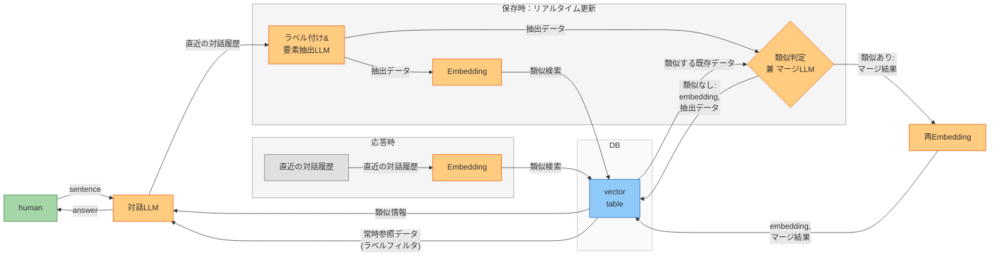

```mermaid
graph LR
  human --sentence--> 対話LLM --answer--> human

  subgraph save["保存時：リアルタイム更新"]
    ラベル付け["ラベル付け&<br>要素抽出LLM"] --抽出データ--> Embedding
    ラベル付け --抽出データ--> 類似判定{"類似判定<br>兼 マージLLM"}
  end

  対話LLM --直近の対話履歴--> ラベル付け

  subgraph DB
    vectorDB["vector<br>table"]
  end

  subgraph 応答時
    直近の対話履歴 --直近の対話履歴--> Embedding2[Embedding]
  end

  Embedding --類似検索--> vectorDB --類似する既存データ--> 類似判定
  類似判定 --"類似なし:<br>embedding,<br>抽出データ"--> vectorDB
  類似判定 --"類似あり:<br>マージ結果"--> 再Embedding[再Embedding] --"embedding,<br>マージ結果"--> vectorDB

  Embedding2 --類似検索--> vectorDB --類似情報--> 対話LLM
  vectorDB --"常時参照データ<br>(ラベルフィルタ)"--> 対話LLM

  style save fill:#f5f5f5,stroke:#9e9e9e
  style DB fill:#fafafa,stroke:#bdbdbd
  style 応答時 fill:#f5f5f5,stroke:#9e9e9e

  style human fill:#a5d6a7,stroke:#2e7d32
  style 対話LLM fill:#ffcc80,stroke:#e65100
  style ラベル付け fill:#ffcc80,stroke:#e65100
  style Embedding fill:#ffcc80,stroke:#e65100
  style 類似判定 fill:#ffcc80,stroke:#e65100
  style 再Embedding fill:#ffcc80,stroke:#e65100
  style Embedding2 fill:#ffcc80,stroke:#e65100
  style 直近の対話履歴 fill:#e0e0e0,stroke:#757575
  style vectorDB fill:#90caf9,stroke:#1565c0
  style 直近の対話履歴 fill:#e0e0e0,stroke:#757575
```
