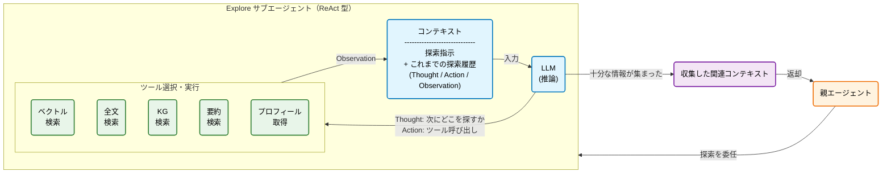

```mermaid
graph LR
    %% スタイル定義
    classDef parent fill:#fff3e0,stroke:#ef6c00,stroke-width:2px,color:black;
    classDef sub fill:#e1f5fe,stroke:#0277bd,stroke-width:2px,color:black;
    classDef tool fill:#e8f5e9,stroke:#2e7d32,stroke-width:2px,color:black;
    classDef result fill:#f3e5f5,stroke:#7b1fa2,stroke-width:2px,color:black;

    MainAgent("親エージェント"):::parent
    MainAgent -->|"探索を委任"| sub

    subgraph sub ["Explore サブエージェント（ReAct 型）"]
        SubCtx("コンテキスト<br/>-----------------------------<br/>探索指示<br/>+ これまでの探索履歴<br/>(Thought / Action / Observation)"):::sub

        SubCtx -->|"入力"| SubLLM("LLM<br/>(推論)"):::sub

        SubLLM -->|"Thought: 次にどこを探すか<br/>Action: ツール呼び出し"| toolSelect

        subgraph toolSelect ["ツール選択・実行"]
            Vec("ベクトル<br>検索"):::tool
            BM("全文<br>検索"):::tool
            KG("KG<br>検索"):::tool
            History("要約<br>検索"):::tool
            Profile("プロフィール<br>取得"):::tool
        end

        toolSelect -->|"Observation"| SubCtx
    end

    SubLLM -->|"十分な情報が集まった"| Result("収集した関連コンテキスト"):::result
    Result -->|"返却"| MainAgent
```
