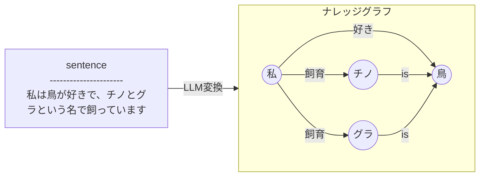

```mermaid
graph LR
    content["sentence<br>----------------------<br>私は鳥が好きで、チノとグラという名で飼っています"] --LLM変換--> ナレッジグラフ
    subgraph ナレッジグラフ
        direction LR
        私((私)) --好き--> 鳥((鳥))
        私 --飼育--> チノ((チノ))
        私 --飼育--> グラ((グラ))
        チノ --is--> 鳥
        グラ --is--> 鳥
    end
```
