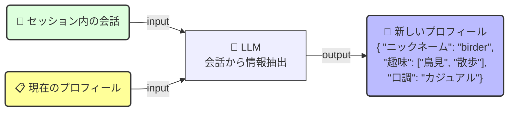

```mermaid
flowchart LR
    Conv("💬 セッション内の会話")
    Profile("📋 現在のプロフィール")

    LLM["🤖 LLM<br>会話から情報抽出"]

    NewProfile("📝 新しいプロフィール<br>{  &quot;ニックネーム&quot;: &quot;birder&quot;,<br>  &quot;趣味&quot;: [&quot;鳥見&quot;, &quot;散歩&quot;],<br>  &quot;口調&quot;: &quot;カジュアル&quot;}")

    Conv -->|"input"| LLM
    Profile -->|"input"| LLM
    LLM -->|"output"| NewProfile

    style Conv fill:#dfd,stroke:#333,stroke-width:2px
    style Profile fill:#ff9,stroke:#333,stroke-width:2px
    style NewProfile fill:#bbf,stroke:#333,stroke-width:2px
    style LLM fill:#eef,stroke:#333
```
