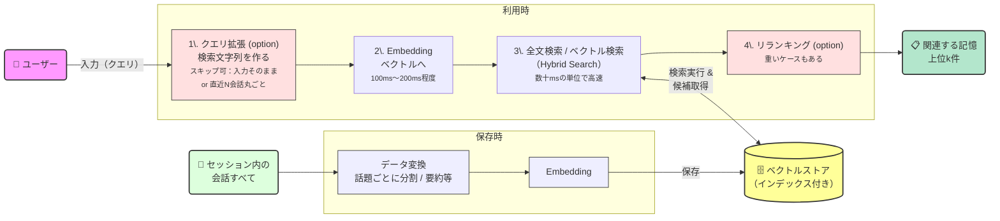

```mermaid
flowchart LR
    %% 外部エンティティ
    User("👤 ユーザー")
    Session("💬 セッション内の<br>会話すべて")
    DB[("🗄️ ベクトルストア<br>（インデックス付き）")]

    %% 保存時の処理 (Ingestion)
    subgraph Ingestion ["保存時"]
        direction TB
        Ingest1["データ変換<br>話題ごとに分割 / 要約等"]
        Ingest2["Embedding"]
    end

    %% 利用時 (Retrieval)
    subgraph Retrieval ["利用時"]
        direction TB
        Step1["1\. クエリ拡張 (option)<br>検索文字列を作る<br><span style='font-size:0.8em'>スキップ可：入力そのまま<br>or 直近N会話丸ごと</span>"]
        Step2["2\. Embedding<br>ベクトルへ<br><span style='font-size:0.8em'>100ms〜200ms程度</span>"]
        Step3["3\. 全文検索 / ベクトル検索<br>（Hybrid Search）<br><span style='font-size:0.8em'>数十msの単位で高速</span>"]
        Step4["4\. リランキング (option)<br><span style='font-size:0.8em'>重いケースもある</span>"]
    end
    Output("📋 関連する記憶<br>上位k件")

    %% データフロー：保存側
    Session --> Ingest1
    Ingest1 --> Ingest2
    Ingest2 -->|"保存"| DB

    %% データフロー：利用側
    User -->|"入力（クエリ）"| Step1
    Step1 --> Step2
    Step2 --> Step3
    Step3 <-->|"検索実行 &<br>候補取得"| DB
    Step3 --> Step4
    Step4 --> Output

    %% スタイル定義
    style User fill:#f9f,stroke:#333,stroke-width:2px
    style Session fill:#dfd,stroke:#333,stroke-width:2px
    style DB fill:#ff9,stroke:#333,stroke-width:2px
    style Output fill:#b3e6cc,stroke:#333,stroke-width:2px

    style Ingest1 fill:#eef,stroke:#333
    style Ingest2 fill:#eef,stroke:#333

    style Step1 fill:#ffe0e0,stroke:#333
    style Step4 fill:#ffe0e0,stroke:#333
```
