<!-- 時計/タイマー -->
<script src="timer.js"></script>

<!-- タイトルのみページ番号スキップ -->
<!-- _paginate: skip -->
<!-- 中央寄せ -->
<!-- _class: vertical-center -->

<div class="flex vertical-center">
<div>

# 対話型AIの記憶管理
## 〜ライブラリ調査を通して〜
### Tomoki Yoshida (birder) 🐦️
DeNA
AI技術開発部AIイノベーショングループ

2026-03-24

</div>

</div>

---

# 自己紹介

<div class="flex vertical-center">
<div>

### 吉田 知貴（birder）
<div class="text-center">


</div>

</div>

<div>

- 学生時代
    - 機械学習凸最適化の高速化 ([KDD2018](https://www.kdd.org/kdd2018/accepted-papers/view/safe-triplet-screening-for-distance-metric-learning), [KDD2019](https://www.kdd.org/kdd2019/accepted-papers/view/learning-interpretable-metric-between-graphs-convex-formulation-and-computa))
    - 2018年 DeNAサマーインターン
- 社会人
    - 2020年 DeNA新卒入社
    - エネルギー事業（組み合わせ最適化）
    - ライブ配信Pococha（[CS審査効率化、レコメンド](https://www.docswell.com/s/DeNA_Tech/K4V978-aiday-specific-1500)）
    - **新規AIプロダクト開発**

<span class="text-right">

Qiita: [@birdwatcher](https://qiita.com/birdwatcher)
X: [@birdwatcherYT](https://x.com/birdwatcheryt)
</span>

</div>
</div>

---

<!-- タイトルのみページ番号スキップ -->
<!-- _paginate: skip -->
<!-- 中央寄せ -->
<!-- _class: vertical-center -->
# 対話型AIの記憶管理

こういう体験を実現したい↓

（1ヶ月前）人間「パソコンが壊れた」
（今日）人間「パソコンを買ったよ」 → AI「前壊れたって言ってたもんね！」

**1ヶ月間の対話を全部LLMに入れるわけにもいかないがどうすればいい...？**

---

# コンテキスト管理をしよう
## LLMの限界
- [コンテキストウィンドウ（入力上限）](https://ai.google.dev/gemini-api/docs/long-context?hl=ja)がある（小説8冊分とか入る）
- 詰め込みすぎると指示を無視したり、遅くなったり、性能劣化する

↓ **LLMに与える情報を管理してあげる必要がある**
## <span class="red">コンテキストエンジニアリング</span>
無数に増えていく会話履歴やユーザー情報を
- どう保存するか（そのまま？ラベル付け？集計？圧縮？）
- どう検索するか（最新N件？関連度？重要度？）

---
# コンテキスト管理で意識すること

<div class="text-center">



</div>

- <span class="red">データ取得時の**検索クエリ** と データ保存時の**加工処理**が設計ポイント！</span>
- レイテンシを気にする会話では**取得時の処理の重さ**を気にすることになる
- **保存処理は非同期**（バックグラウンド）でやれることが多いので重くてもOK
- <u>保存時期と量</u>: セッション単位（履歴をまとめて） or 毎ターン（直近1-2ターン）

---

# 記憶管理のノウハウを持ったいろんなライブラリ
<div class="flex">
<div>
<span class="tiny">

| 分類 | | Vec | KG | Prof | QE | Rerank | Agent |
|---|---|:---:|:---:|:---:|:---:|:---:|:---:|
| 記憶管理 | [Mem0](https://github.com/mem0ai/mem0) | ○ | ○ | | | ○ | |
| | [Zep](https://github.com/getzep/zep), [Graphiti](https://github.com/getzep/graphiti) | ○ | ○ | ○ | | ○ | |
| | [Letta (旧MemGPT)](https://github.com/letta-ai/letta) | ○ | | ○ | | ○ | ○ |
| | [SimpleMem](https://github.com/aiming-lab/SimpleMem) | ○ | | | ○ | | ○ |
| | [MemOS](https://github.com/MemTensor/MemOS) | ○ | ※ | | ○ | ○ | ○ |
| | [MemoryOS](https://github.com/BAI-LAB/MemoryOS) | ○ | | ○ | | | |
| | [Memary](https://github.com/kingjulio8238/Memary) | | ○ | | ○ | | |
| | [GraphRAG](https://github.com/microsoft/graphrag) | ○ | ○ | | ○ | | |
| 汎用FW | [LangChain](https://github.com/langchain-ai/langchain), [LangGraph](https://github.com/langchain-ai/langgraph) | ○ | ○ | | | ○ | |
| | [ADK](https://github.com/google/adk-python) | ○ | | | | ○ | ○ |
| | [LlamaIndex](https://github.com/run-llama/llama_index) | ○ | ○ | ○ | ○ | ○ | |
| 汎用Agent | [OpenCode](https://github.com/anomalyco/opencode) | | | | | | ○ |
| | [OpenClaw](https://github.com/openclaw/openclaw) | ○ | | | ○ | ○ | |

</span>
</div>
<div>

- **Vec**: ベクトル検索
- **KG**: ナレッジグラフ
- **Prof**: 抽出済みプロフィール
- **QE**: クエリ拡張
- **Rerank**: リランキング
- **Agent**: Agentic検索

<span class="small">※ グラフDBで記憶を構造化管理するが、検索時のグラフ走査はなし</span>

</div>
</div>


---

# 取得時の手法とレイテンシ

<div class="flex horizontal-center">

| 手法 | 速度感 |
|---|---|
| 抽出済み情報（プロフィール等） | 即座（検索不要） |
| 全文検索, ベクトル検索, ハイブリッド検索 | 高速（数十〜数百ms） |
| リランキング（CrossEncoder等） | やや重い（手法に依る） |
| クエリ拡張 | やや重い（LLM呼び出し） |
| ナレッジグラフ（Graph RAG） | 重い |
| Agentic検索 | 重い（複数回LLM呼び出し） |

</div>

ライブラリを使えばOKというより、<span class="red">**プロダクトの性質に合わせて設計**</span>する必要がある
→ 自分で作れるように、各手法や工夫を紹介していく


---

<!-- タイトルのみページ番号スキップ -->
<!-- _paginate: skip -->
<!-- 中央寄せ -->
<!-- _class: vertical-center -->
# 短期記憶
## 長期記憶の前に...


---
# 短期記憶: セッション内メモリ
システム的に扱いやすい小さい単位（セッション）があれば会話履歴をそのまま扱う

```json
[
  {"role": "user", "content": "こんにちは！"},
  {"role": "assistant", "content": "こんにちは！どうしましたか？"},
  {"role": "user", "content": "この前、〇〇したんだよね〜"}
]
```

- 基本、会話するたびにappendするだけ（コンテキストキャッシュが効く）
- 長い会話やセッション概念がない場合は<span class="red">**スライドウィンドウや圧縮**</span>が入る
    - **スライドウィンドウ**: 古い履歴を削除 or 古い履歴を**要約**して圧縮
    （LangChain, Letta, ADK, [Gemini Live API](https://docs.cloud.google.com/vertex-ai/generative-ai/docs/live-api/start-manage-session?hl=ja#configure_the_context_window_of_the_session)等）
    - 直近N件は保護し、**古いツール出力の削除**(OpenCode, OpenClaw, LangChain)

---

# 短期記憶: 直近セッションの情報
セッションまたいだら記憶が失われる対策
- 前回セッションの会話履歴（の一部）
- <span class="red">**直近N回のセッションの会話履歴の要約**</span>
    - 保存時: 要約は非同期で行えば良い
    - 取得時: 直近N件取ってくるだけ

ChatGPTは[直近15セッションの要約](https://manthanguptaa.in/posts/chatgpt_memory/)と噂がある（非公式）
SimpleMemでは、セッション開始時に`サマリー（~5件）→過去セッションの知見（~20件）→セマンティック検索（~10件）`の優先度順で指定トークン上限まで入れる

---

<!-- タイトルのみページ番号スキップ -->
<!-- _paginate: skip -->
<!-- 中央寄せ -->
<!-- _class: vertical-center -->
# 長期記憶

---
# 長期記憶: 抽出済み情報（プロフィール）
- <span class="red">**毎回必ずコンテキストに含めたいユーザーの情報**を定義して抽出</span>
    - 例: 名前、生年月日、趣味、家族、重要イベントなど サービスで重要なこと
    - MemoryOSでは 性格・嗜好傾向を51項目で構造化抽出
- <u>保存時</u>: 会話から情報抽出、<u>取得時</u>: 全部入れるだけ

<div class="text-center">



</div>

ChatGPTも[これに似た噂](https://manthanguptaa.in/posts/chatgpt_memory/)があり、わかっているフリならこれでOK
<span class="small">（私は最近ChatGPTにメモリを整理しろと言われてますが、UI上からも抽出している情報が見えますね）</span>

---
# 長期記憶: ベクトル検索（典型的なRAG）
<span class="red">**ベクトル検索**で現在の会話内容に関連した過去の情報を取得</span>



- <u>保存時</u>: ファクト抽出 or 要約 or 話題分割など[一般的なRAGテクニック](https://github.com/NirDiamant/RAG_Techniques)も使える

Mem0は、会話から事実をLLMで抽出し7カテゴリ（嗜好、個人情報、計画等）に分類
SimpleMemは、代名詞解決・相対時間の絶対化・アトミックな事実文への分解


---
# 検索精度を上げる工夫

- <span class="red">**ハイブリッド検索**</span>: ベクトルと全文検索などの組み合わせ
    - OpenClaw: ベクトルスコア×0.7 + BM25スコア×0.3 の重み付き合算
    - MemOS: グラフ、ベクトル、BM25、全文検索の4手法の並列後リランク
- <span class="red">**クエリ拡張**</span>: 指示語解決や文脈補完、言い換えなどで検索用文字列を生成
    - MemOS: LLMでサブクエリに分解→各embeddingで並列検索
- <span class="red">**リランキング**</span>: 検索結果をモデルで並べ替え
    - Mem0: Cohere、SentenceTransformer等
    - Zep: RRF、MMR、CrossEncoder等5種のリランカー

<div class="small">

BM25: 全文検索のスコア, RRF: 順位の逆数のスコア, MMR: 多様性確保の指標, 
CrossEncoder: 質問と文書から関連スコアを出すモデル, Cohere: リランキングAPI（企業名）
</div>

---
# 長期記憶: Graph RAG

<span class="red">Entity（ノード）とRelation（エッジ）を**ナレッジグラフ**に保存</span>し、構造的に検索


<div class="text-center">


</div>

- <u>保存時</u>: **LLMでEntity&Relation抽出** → **既存ノードと類似度マッチで重複判定**
- <u>検索時</u>: **Entity抽出** → **表記ゆれ吸収** → Cypher**テンプレ走査** → BM25リランク
<div class="small">

<u>補足</u>: 上記はMem0の実装。MS GraphRAGはグラフをクラスタ化し、コミュニティ単位で要約レポートを生成。検索はEntity周辺・要約集約などモード選択が必要。これらのライブラリでは**LLMでCypherクエリ生成が難しい点をテンプレで解決**している。（[LangChain Neo4j](https://github.com/langchain-ai/langchain-neo4j)はLLMで生成しているが困難）
<u>課題</u>: 対策しても表記ゆれは起きる、遅い、 **LLM依存度が高く不安定**（個人の感想）
</div>

---

# 記憶整理（忘却、更新、重複排除）

- 古い記憶を使いたくない（忘却）
    - **フィルター**: ベクトル検索時にタイムスタンプで絞る
    - **時間減衰**: スコアに減衰関数を掛けて古い記憶の優先度を下げる
        - ベクトル検索のインデックスが効かなくなるので[リランキング](https://milvus.io/docs/ja/decay-ranker-overview.md)で対応
- 記憶のアップデートをしたい（重複判定含む）
    - 保存時に<span class="red">**ベクトル検索で既存記憶を取得→LLMが比較して判定**</span>（Mem0）
        - 例: 「ペットを飼っている」+「嘘でした」→ 削除
        - 例: 「ペットを1匹」+「もう一匹飼った」→ 「ペットを2匹飼っている」
- 記憶の変化を追跡したい（例: 「独身」→「結婚した」→「離婚した」など）
    - タイムスタンプや有効期間を付与し検索後に推移を追跡可能に（Zep）

---
# 長期記憶: Agentic検索
<span class="red">**Agentがコンテキスト取得ツールを何度も呼び出し、目的のコンテキストを探す**</span>

- OpenCode: grep, glob, read等のツールを持つ**explore専用サブエージェント**へ依頼（Claude Code, Cursorなども同様と推測）
- Letta: 記憶の読み書きツールをエージェントが自分で判断して呼び出す
- MemOS: クエリ分析→検索→十分性Reflection→再検索のループ

<u>一般会話での難しさについて経験談</u>: 
- **ツール呼び出し判定がシビア**（毎回調べるか全く調べないかになってしまう）
    - いつ調べるべきなのかわからないし、情報の十分性の基準もわからない
- レスポンス速度が遅い（**自然な会話は500ms~1s程度で返さないと不自然**）

---
# その他の工夫

- **ラベル付け**: メタデータ付与でSQLフィルタ検索を可能に（SimpleMem, Letta）
- **階層型管理**: 短期→中期→長期へ自動昇格
（MemoryOS: deque溢れ→LLM要約でセッション化→ヒートスコア超で長期へ）
- **参照カウント**: エンティティ参照回数の上位N件を優先注入（Memary）
- **重要度スコア**: 記憶にスコアを持たせてメンテナンスに活用
    - MemoryOS: ヒートスコア=訪問回数・対話長・時間減衰の重み付き和
    - SimpleMem: 時間減衰・重複マージ判定・低スコア刈り込みに使用
- **レスポンス高速化**
    - 並列処理、Streaming、Thinkingを切る、フィラー（「えーと」等）時間稼ぎ
    - 今までの会話情報から[事前に検索](https://arxiv.org/abs/2403.05676)しておく、[予測して準備](https://arxiv.org/abs/2508.04403)しておく

---

<!-- タイトルのみページ番号スキップ -->
<!-- _paginate: skip -->
<!-- 中央寄せ -->
<!-- _class: vertical-center -->
# ここまでの知識を使って設計してみよう！

---

# 設計例1: セッション単位で処理



セッション終了後にテーマ分割・プロフィール抽出で一括保存し、
応答時は現在セッション＋検索でコンテキストを組み立てる

---
# 設計例2: ファクト抽出とリアルタイム更新



対話のたびに抽出・類似判定でDBを更新し、応答時は類似検索とラベルで取得する

---
# 設計例3: Agenticサーチ



ループして適応的に記憶検索ツールを使いこなし、必要なコンテキストを収集する


<div class="small">

（簡易実装ではLangChainの`creat_agent`、ADKの`LlmAgent`、Mastraの`Agent`等の`tools`に与えるだけ）

<u>余談</u>: 会話履歴をファイルに置いて汎用Coding Agentに任せるパターンもありうるが、OpenCodeでは**list/globは100ファイル、grepは100マッチ、readは2000行と50KB、1行2000文字で打ち切り**される。ファイル数や1ファイルの容量が増えるとtruncate後に、クエリ変えつつgrepやoffset変えつつreadするなど探索が必要で、探索回数が増えて、性能が落ちる可能性がある。
</div>


---

# 手法と改善イメージ

<div class="tiny">

**1年前**:「文鳥チノを飼っている」「文鳥がペレットを食べない」 **1ヶ月前**:「パソコンが壊れちゃった」「来月登壇イベントがあるんだ」
**1週間前**:「文鳥の雛にグラって名付けた」**一昨日**:「明後日キャンプ行くんだ」

| 手法 | 人間の入力 | AIの応答 | 解説 |
|:------------:|------------|----------|----------|
| ベースライン | パソコンを買ったよ<br>今日めちゃめちゃ暑い | ❌️どんなパソコンを買ったの？<br>❌️そうだね！ | 当然覚えてない<br>適当に合わせた応答をする |
| 現在日時付与 | 今日めちゃめちゃ暑い | ⭕️3月なのになんかあった？ | 重要体験。記憶との時間関係でも必須 |
| プロフィール | ペットショップに行かなきゃ | ⭕️チノのエサが切れちゃった？ | ペットのような関係性を抽出し保持 |
| 直近サマリー | 今日は楽しかったなー | ⭕️お、今日キャンプだった？ | 直近情報を常に入れておけば可能 |
| ベクトル検索 | パソコンを買ったよ<br>そろそろ登壇がある → 前その話した？<br>今日は緊張したよ | ⭕️前壊れたって言ってたもんね！<br>❌️初めて聞いたよ<br>❌️お疲れ様。なんかあった？ | 類似度高い会話を検索成功<br>「前その話した？」では検索失敗<br>「緊張」で類似検索しても無理 |
| クエリ拡張 | そろそろ登壇がある → 前その話した？<br>パソコンで登壇資料作らなきゃ | ⭕️先月言ってた登壇イベントだね<br>⭕️PC直ったの？そろそろ登壇だね | 文脈から「登壇」を検索<br>「PC」「登壇」に複数クエリ分割 |
| 全文検索 | グラが飛べるようになった | ⭕️文鳥の成長は早いね | ベクトル検索で弱い固有名詞対策 |
| 保存時クエリ予測 | 今日は緊張したよ | ⭕️もしかして登壇今日だった？ | 保存時に「緊張」が来ると予想 |
| Agentic検索 | チノのご飯買わなきゃ | ⭕️文鳥チノちゃんにはシードだね | チノ→文鳥、文鳥→ペレット嫌い発見 |

</div>

---

# まとめ
- 設計の軸は<span class="red">**保存時の加工**</span>と<span class="red">**取得時の検索**</span>
- 短期〜長期記憶、細かい工夫まで手法が多彩 → 要件に応じた設計が必要
- OSSの実装を参考に、プロダクトに合った組み合わせを探ろう

<div class="flex text-center horizontal-evenly">
<div>

[**前回の資料**](https://birdwatcheryt.github.io/ai-talks4/)


</div>

<div>

[**今回の資料**](https://birdwatcheryt.github.io/ai-talks7/)


</div>

</div>


---


<!-- タイトルのみページ番号スキップ -->
<!-- _paginate: skip -->
<!-- 中央寄せ -->
<!-- _class: vertical-center -->
# Appendix
## 各ライブラリ調査レポート（読み物）
AIと壁打ちしながらレポジトリを理解したメモ。一部実際に触ってみた感想。

---

<!-- _paginate: skip -->
# 調査対象バージョン
<div class="small flex horizontal-center">

| ライブラリ | バージョン | 最終コミット日 |
|---|---|---|
| Mem0 | v1.0.5 | 2026-03-09 |
| Zep | v1.0.2 | 2026-02-14 |
| Graphiti | v0.28.2 | 2026-03-11 |
| Letta | 0.16.6 | 2026-03-03 |
| SimpleMem | v0.1.0 | 2026-02-26 |
| MemOS | v2.0.8 | 2026-03-09 |
| MemoryOS | V1.2 | 2026-03-03 |
| Memary | v0.1.5 | 2024-10-18 |
| GraphRAG | v3.0.5 | 2026-03-06 |

| ライブラリ | バージョン | 最終コミット日 |
|---|---|---|
| LangChain | 1.2.11 | 2026-03-10 |
| LangGraph | 1.1.1 | 2026-03-11 |
| ADK | v1.25.0 | 2026-03-10 |
| LlamaIndex | v0.14.16 | 2026-03-10 |
| OpenCode | v1.2.24 | 2026-03-11 |
| OpenClaw | v2026.3.8 | 2026-03-11 |

</div>

---

<!-- _paginate: skip -->
# Mem0（1/2）
<div class="small">

AIアシスタントやエージェントに長期記憶レイヤーを提供するライブラリ

- 短期記憶は持たない
- 基本的にシンプルなベクトル検索という印象（グラフはデフォルトでOFF）
- user_idごとの会話を保存できる
- LLMで**ファクト（事実文）抽出** → ベクトルストアに保存
    - 抽出カテゴリは7種（嗜好、個人情報、計画、健康、職業…）
    - ❌️ 「元気？」は保存されたので、追加プロンプトでチューニングは必要
    - → `custom_fact_extraction_prompt` で抽出処理をカスタマイズ可能
- ベクトルストア20種以上サポート（Qdrant, Chroma, PGVector, Milvus, FAISS…）
- ❌️ 常にコンテキストに含めたい情報（名前等）を管理する仕組はがない
    - 検索結果に含まれる保証がないので、重要情報を毎回確実に渡せない

</div>

---

<!-- _paginate: skip -->
# Mem0（2/2）
<div class="small">

- **記憶更新**: 新ファクトと既存記憶をLLMに比較させ ADD, UPDATE, DELETE, NONE を自動判定
    - 関連する既存記憶の上位5件だけを取ってきて比較している
    - ❌️ 軽く試した感じ重複しやすい・修正がイマイチなことも（強いモデルと明確な指示が必要かも）
- **リランキング対応**（Cohere, SentenceTransformer, HuggingFace, ZeroEntropy, LLM Reranker）
- ❌️ クエリ拡張は無い（単純にクエリ文字列をそのままembedding）
    - 単体の会話を投げると失敗する可能性あり → 前処理やコンテキストをまとめて検索が必要
- **ナレッジグラフにも対応**（Neo4j, Memgraph, Neptune, Kuzu）
    - LLMでエンティティ抽出 → リレーション抽出 → embedding類似度で既存ノードと意味的マッチ
    - 表記ゆれ対策: 文字列正規化 + embedding類似度でノードの同一性判定
    - ❌️ グラフは不安定＆遅くて実用性に課題

</div>

---

<!-- _paginate: skip -->
# Zep, Graphiti（1/2）
<div class="small">

Graphitiベースの時系列ナレッジグラフを活用するコンテキストエンジニアリングプラットフォーム

**短期記憶**
- PostgreSQLにメッセージ保存、`lastN`（デフォルト4〜6件）で直近N件を取得
- OSS版に明示的な要約・圧縮はない（Cloud版の"summary"モードで対応）

**Graphiti: 時系列ナレッジグラフ**
- 検索:
    - 4種: Node（エンティティ）, Edge（ファクト）, Episode（エピソード）, Community（クラスタ）
    - アルゴリズム: BM25 + コサイン類似性 + BFSの組み合わせ
- 保存: エンティティ抽出、関係性抽出、重複除去が行われる


</div>

---
<!-- _paginate: skip -->
# Zep, Graphiti（2/2）
<div class="small">

**長期記憶**
- 取得時は直近4メッセージでGraphitiを検索し、関連Fact（最大5件）を取得
    - Node, Edge, Episode の3つを並列検索
- 各Factに `valid_at`, `invalid_at` で事実の時間的変遷を追跡
- PydanticでKGのスキーマ（ノード型・エッジ型）をドメインごとにカスタム定義可能
    - デフォルト9種: User, Assistant, Preference, Location, Event, Object, Topic, Organization, Document
- 5種のリランカー: RRF（逆順位和）, MMR（多様性確保）, node_distance（グラフ距離）, episode_mentions（頻度）, cross_encoder
- ソフトデリート + 定期パージ方式（`deleted_at` → `purgeDeleted` で物理削除）

</div>

---

<!-- _paginate: skip -->
# Letta（1/3）
<div class="small">

旧MemGPT。OSの仮想メモリ管理に着想を得たステートフルAIエージェントプラットフォーム

**短期記憶: コアメモリ（ブロック）+ メッセージ要約**
- 「ブロック」をシステムプロンプトに埋め込み、エージェント自身がツール呼び出しで読み書き
    - ブロック: デフォルトは `persona`（AIの性格）と `human`（ユーザー情報）の2つ。任意追加可能
    - 追記・置換・行挿入・全書き換え等の編集ツールを5種提供
- 多彩なコンパクション戦略（`CompactionSettings` で切り替え）
    - Static Buffer: 固定件数（デフォルト60件）超過で古いメッセージを削除、最小15件保持
    - Partial Evict: メッセージの30%を削除し、LLMで要約してindex 1に挿入（同期）
    - Sliding Window: スライディングウィンドウ式の部分要約（自身のLLMで行うモードも選択可能）
    - 多段フォールバック: 自身のLLMで要約 → 専用処理で要約 → ツール出力切り詰め → 中間部削除
- トリガー: コンテキストウィンドウの90%超過時、またはLLMがコンテキスト超過エラーを返した時
- 要約プロンプトは7項目（目標、経緯、重要詳細、エラー修正、現状、次ステップ、検索ヒント）

</div>

---
<!-- _paginate: skip -->
# Letta（2/3）
<div class="small">

**長期記憶: アーカイバルメモリ + 会話検索**
- エージェントが重要と判断した情報をツール呼び出しで長期記憶に保存・検索（ベクトル検索）
- 3つのベクトルDBバックエンド: PostgreSQL pgvector（デフォルト）, Turbopuffer, Pinecone
    - Turbopuffer: ハイブリッド検索（ANN + BM25 → RRF統合）、タグ・日付範囲フィルタ
    - Pinecone: リランキング対応（`bge-reranker-v2-m3`）
- 会話検索: `conversation_search` ツールで過去メッセージをハイブリッド検索（同じ仕組み）
- ソフトデリート（`is_deleted` フラグ）。タグの自動重複排除
- ❌️ TTL・時間減衰は未実装

</div>


---

<!-- _paginate: skip -->
# Letta（3/3）
<div class="small">

**工夫**
- メインとは別に、バックグラウンドで動作する**Sleeptimeエージェント**が会話後に記憶を整理
    - メイン応答完了後、Nターンに1回バックグラウンドタスクを発行
    - Sleeptimeエージェントは会話トランスクリプトを受け取り、共有コアメモリブロックを更新
- 役割分担: メインは応答と検索に専念し、コアメモリの編集はSleeptimeに委任
- Git-backedコアメモリ: ブロックをgitリポジトリに保存し変更履歴をコミット単位で追跡
- コアメモリに行番号を付与し、エージェントが行単位で挿入・編集可能に
- ツール呼び出しにルール制約（終了条件、呼び出し順序、回数上限等）を設定可能
- ReActスタイルのエージェントループ（最大50ステップ）
</div>

---

<!-- _paginate: skip -->
# SimpleMem（1/2）
<div class="small">

対話エージェント向けの長期記憶フレームワーク

**リアルタイムな保存処理**
- 対話をLLMで構造化された記憶ユニット（MemoryEntry）に変換
    - 代名詞の排除、相対時間→ISO 8601絶対化、アトミックな事実文への変換、Embedding
- 前ウィンドウの記憶エントリ（最大3件）を参照コンテキストとしてLLMに渡し重複を抑制
- Provenance Tracking: 記憶エントリとソースエビデンスの紐付けを維持

**検索**
- 3層ハイブリッド検索: 意味検索（embedding）+ キーワード検索（BM25）+ メタデータフィルタ（日時・場所・人名等）を並列実行
- LLMが情報要件分析 → ターゲットクエリ生成（最大4件）→ 3層並列検索 → Reflection（十分性判定、最大2ラウンド）

</div>

---

<!-- _paginate: skip -->
# SimpleMem（2/2）
<div class="small">

**セッション間の記憶**
- 保存時: セッション終了時に
    - サマリー: セッションのLLM要約
    - Observation: ツール使用やファイル変更等のイベントからヒューリスティック抽出
- 取得時: セッション開始時に「サマリー（最大5件）→過去セッションの知見（最大20件）→セマンティック検索（最大10件）」の優先度順で指定トークン上限（デフォルト2000トークン）まで入れる

**記憶整理: Consolidation Worker（Decay→Merge→Prune の3フェーズ）**
- Decay: 90日超のエントリに importance × 0.9 の減衰
- Merge: cosine類似度 0.95超のペアで importance が低い方をソフト削除
- Prune: importance 0.05未満のエントリを論理削除

</div>

---

<!-- _paginate: skip -->
# MemOS（1/2）
<div class="small">

汎用AIエージェント向けのMemory Operating System

**保存: メッセージ追加時に全メモリタイプを同時生成**
- メッセージ追加API呼び出し時にリアルタイムで記憶抽出（同期/非同期どちらも対応）
- 二段階処理: LLM不要で即保存 → 非同期でLLMが構造化抽出・タイプ振り分け（レイテンシ隠蔽）
- 記憶抽出時の入力は1024トークンのスライドウィンドウで分割（200トークンオーバーラップ）
- WorkingMemoryは上限20件のFIFO管理（80%到達時に古いものから事前削除）
- embedding類似度（≥0.8）でLLMが矛盾, 冗長, 独立を判定 → 融合 or タイムスタンプで新しい方を残す
- 幻覚フィルタリング: LLM抽出後の記憶を原文対話と照合して根拠のない記憶を除外
- GraphStructureReorganizer: バックグラウンドでKMeans+LLMによるクラスタリング→要約親ノード→関係エッジの自動生成
- MemFeedback: 自然言語による記憶の修正（キーワード置換、セマンティック更新）
- ステータス管理: activated, resolving, archived, deleted

</div>

---

<!-- _paginate: skip -->
# MemOS（2/2）
<div class="small">

**検索**
- メモリタイプ別に以下を並列検索し、リランカーで統合:
    - WorkingMemory: 直近の記憶（上限小さいので全件取得）
    - LongTermMemory: 会話から抽出された長期的な知識
    - UserMemory: ユーザーの属性・嗜好（16項目の客観情報+9項目の主観情報）
    - ToolMemory: ツールのスキーマや過去の実行履歴
    - SkillMemory: エージェントが習得したスキル
    - PreferenceMemory: ユーザーの好み・設定
- LongTermMemory+UserMemoryはグラフ検索+ベクトル検索+BM25+全文検索の4手法を併用
- CoTクエリ拡張: 複雑なクエリをLLMでサブクエリに分解→各embeddingで並列検索
- Agentic検索: QueryRewriter → メモリ検索 → ReflectionAgent（十分性判定）→ 不足なら再検索ループ

</div>

---

<!-- _paginate: skip -->
# MemoryOS（1/2）
<div class="small">

パーソナライズ対話AI向け。OSのメモリ管理メタファーを徹底した3層階層型アーキテクチャ

**短期記憶（deque）**
- `deque(maxlen=10)` で生の会話ペアを保持。要約・圧縮なし
- 満杯になると最古の会話ペアが中期記憶へ追い出し

**中期記憶（セッション + FAISS + ヒープ）**
- 追い出された会話ペアをLLMでマルチトピック要約（最大2テーマ）→ テーマ別にセッション化
- セッションマージ判定: 意味的類似度 + キーワードJaccard類似度の合算スコア
- 2段階検索: FAISSでセッション絞り込み → 会話ペア単位で類似度フィルタ → 全体からtop-N選出
- ヒートスコア: 検索ヒット回数 + 蓄積会話ペア数 + 直近アクセス度（時間減衰）の重み付き合算
- ページ間の双方向リンクで会話連鎖を保持
- LFU追い出し（セッション数がmax_capacityを超えた場合）

</div>

---
<!-- _paginate: skip -->
# MemoryOS（2/2）
<div class="small">

**長期記憶（プロフィール + ナレッジ）**
- ヒートスコアが閾値を超えると昇格トリガー → LLMで並列に以下を実行
    - パーソナリティ分析（プロンプト上は「90次元」だが実装は51次元: Big Five+Needs 16、AI Alignment 8、コンテンツ興味タグ 27）
    - 知識抽出（ユーザー私的データ + アシスタント知識を分離管理）
- ナレッジは deque(maxlen=100) で容量管理。FAISSで検索
- 検索は3並列実行（中期記憶、ユーザー知識、アシスタント知識）
- Embeddingキャッシュ（10,000エントリ超で古い1,000件を削除）

</div>

---

<!-- _paginate: skip -->
# Memary（1/2）
<div class="small">

ツール呼び出し型パーソナルエージェント向けのKGベース記憶管理ライブラリ
**短期記憶**
- `Context`（role+content）のリストで会話履歴を保持（JSONファイルに永続化）
- 先頭2件と末尾5件は保護。中間メッセージをLLMで50語に要約（約2867トークン超過で発火）

**長期記憶: ナレッジグラフ + Memory Module の二層構造**
- ナレッジグラフ: エージェントの応答を自動的にトリプレットとしてKGに書き戻し（自己成長型）
    - 検索はキーワードモード + LLMによる動的同義語展開 + 深さ1〜2のサブグラフ取得
    - KGにヒットなければPerplexity APIで外部検索にフォールバック
- Memory Stream: エンティティ名+タイムスタンプのログ（知識の幅=breadth）
- Entity Knowledge Store: エンティティごとの参照回数+最新日時（知識の深さ=depth）
    - 参照回数上位20エンティティをコンテキストに注入してパーソナライズ
    - ❌️ 実装にバグの疑いあり（上位ではなく下位が選択されている可能性）

</div>

---
<!-- _paginate: skip -->
# Memary（2/2）
<div class="small">

**記憶整理**
- `remove_old_memory(days)` による日数ベース削除はあるが自動発火なし
- Entity Knowledge Store レベルで同名エンティティは1件に統合（参照回数は加算）
- ❌️ TTL・時間減衰・矛盾検出は未実装

**アーキテクチャ**
- モノリシック構成。LlamaIndex ReActエージェントによる Thought→Action→Observation ループ
- ペルソナファイル（system, user）を手動作成し、エージェントの性格・ユーザー属性を常駐
- ❌️ ベクトル検索を使わずKGのキーワード検索に依存 → セマンティックなあいまい検索に弱い

</div>


---
<!-- _paginate: skip -->
# GraphRAG（1/2）
<div class="small">

Microsoft GraphRAG。非構造テキストからLLMでナレッジグラフを構築するバッチ型パイプライン

**保存時: ナレッジグラフ構築**
- テキストチャンク → LLMでエンティティ・リレーションシップ抽出 → 説明文のLLM要約 → Hierarchical Leidenで階層コミュニティ構築 → コミュニティレポート生成
- Gleanings: 「多くのエンティティが見落とされている」とLLMに追加抽出を繰り返し促す
- 増分インデックス: 差分ドキュメントのみ処理→旧インデックスとマージ

**検索時: 4つの戦略**
- Local Search: エンティティ中心。ベクトル類似度でエンティティ特定 → コミュニティレポート+テキストチャンク+エンティティテーブルをトークン予算に配分
- Global Search: コミュニティレポートのMap-Reduce。並列LLMでスコア付き要点抽出→集約
- DRIFT Search: HyDE（仮説文書embedding）→ フォローアップクエリで反復的にLocal Search深堀り
- Basic Search: テキストユニットへの直接ベクトル検索（標準RAG）

</div>

---
<!-- _paginate: skip -->
# GraphRAG（2/2）
<div class="small">

**工夫**
- Dynamic Community Selection（Global Searchのオプション）: ルートから階層的にLLMで関連度評価（0-5）→ 閾値以上のコミュニティだけ再帰探索
- リレーションシップの優先順位: in-network（選択エンティティ間）を最優先、out-networkは共有リンク数でソート
- コンテキスト枠の厳密管理: 各セクション（会話履歴、コミュニティ、エンティティ等）にトークン上限を個別配分
- 全検索モードでストリーミング対応
- タイムスタンプ自動管理（年月日時を分解してフィルタ可能なフィールドとして保存）
- ❌️ TTLや時間減衰スコアリングは未実装

</div>

---

<!-- _paginate: skip -->
# LangChain, LangGraph（1/2）
<div class="small">

LLMアプリケーション構築フレームワーク + ステートフルエージェント基盤

**短期記憶**

- SummarizationMiddleware: トークン超過時に古いメッセージをLLMで構造化要約に置換
    - ユーザーの目的・意思決定・変更ファイル・残タスクの4セクション
- ContextEditingMiddleware: トークン超過時に古いツール出力を `[cleared]` に置換（直近N件保護）
- Checkpoint: thread_id単位で実行状態をステップごとにスナップショット → 同一thread_idで会話継続
- タイムトラベル: checkpoint_id指定で過去の任意の状態に巻き戻し可能
- pre_model_hook, post_model_hook: LLM呼び出し前後にカスタムロジックを差し込む拡張点
- ノード出力キャッシュ: 同一入力に対するノード再実行をスキップ（TTL付き）
- Classic Memory（deprecated）: Buffer, Window, Summary, SummaryBuffer 等

</div>

---
<!-- _paginate: skip -->
# LangChain, LangGraph（2/2）
<div class="small">

**長期記憶**
- スレッド横断の汎用KVストア（階層パスでユーザーやプロジェクト別に分離可能）
    - 記憶の抽出・保存ロジックは組み込まれず、開発者がノード内で実装する「インフラ」
- ベクトル検索・フィルタ検索に対応
- TTL: 読み書き時にリフレッシュ（頻繁にアクセスされるアイテムは期限切れにならない）
- Classic Memory（deprecated）: VectorStoreRetrieverMemory, EntityMemory, KGMemory 等
- [LangChain Community](https://github.com/langchain-ai/langchain-community) にKGメモリ（NetworkX）、[LangChain Neo4j](https://github.com/langchain-ai/langchain-neo4j) にグラフDB連携あり

</div>

---

<!-- _paginate: skip -->
# ADK（1/2）
<div class="small">

Google Agent Development Kit。エージェント構築フレームワーク。記憶管理はフレームワークの一機能

**短期記憶: 多彩なコンテキスト制御**
- 2つの圧縮戦略
    - トークン閾値ベース: `token_threshold` 超過時にLLMで要約（直近N件は非圧縮で保持）
    - スライディングウィンドウ: N回の呼び出しごとにトリガー（overlap_sizeで文脈連続性を維持）
- コンテキストキャッシュ（`ContextCacheConfig`）: キャッシュ再利用回数上限、TTL、最小トークン数を設定可能
- `static_instruction` で静的システムインストラクションを分離 → Gemini APIのキャッシュの恩恵
- サブエージェント間のコンテキスト分離
- ツール呼び出し/応答ペアが分断されないよう安全な分割位置を算出

</div>

---
<!-- _paginate: skip -->
# ADK（2/2）
<div class="small">

**長期記憶: 3層のメモリサービス実装**
- InMemoryMemoryService: キーワードマッチング（プロトタイプ用）
- VertexAiRagMemoryService: Vertex AI RAGコーパスにアップロード → ベクトル検索
- VertexAiMemoryBankService: マネージドサービス（統合・リビジョン・TTL対応、非同期メモリ生成）

**メモリ取得の2パターン**
- ユーザー入力で即検索（通常RAG） か LLMが判断して検索（Agentic RAG）を選択可能

</div>

---
<!-- _paginate: skip -->
# LlamaIndex（1/2）
<div class="small">

LLMアプリケーション構築のためのデータフレームワーク

**短期記憶**
- 会話メッセージを毎ターンDBに保存（デフォルトSQLite、PostgreSQL等に切替可能）
- トークン超過時、古いメッセージを排出 → 長期記憶ブロックに自動転送（会話ペア単位で安全に分割）
- ツール呼び出しループ中はメモリ書き込みを遅延し、完了後にまとめて保存
- ChatMemoryBuffer（スライディングウィンドウ）、ChatSummaryMemoryBuffer（要約）はdeprecated


</div>

---
<!-- _paginate: skip -->
# LlamaIndex（2/2）
<div class="small">

**長期記憶**
- VectorMemoryBlock: 排出メッセージバッチをベクトルストアに格納 → 直近N件からクエリ構築して検索
    - node_postprocessors でリランキング・フィルタリング可能
    - TimeWeightedPostprocessor: `(1-decay)^hours` の時間減衰スコアリング
- FactExtractionMemoryBlock: LLMでファクト抽出（重複排除あり）→ max_facts 超過時にLLMで凝縮
- StaticMemoryBlock: 開発者が設定した固定テキストを毎回注入するだけ
- PropertyGraphIndex: LLMでエンティティ・リレーション抽出しグラフ構築（Neo4j等7種対応）
    - 検索はLLM同義語展開、ベクトル、Cypher生成、テンプレートの4種を組合せ可能
- トークン超過時はメモリブロック単位で低優先度から順に切り詰め（優先度は開発者が設定）

</div>

---


<!-- _paginate: skip -->
# OpenCode（1/3）

<div class="small">
オープンソースのAIコーディングエージェント

**短期記憶: Compaction + Pruning の二段構成**
- Compactionエージェントが会話全体を要約
    - 要約テンプレート: Goal, Instructions, Discoveries, Accomplished, Relevant files
    - オーバーフロー時、ユーザーの最後の質問を退避→要約完了後に再投入（メッセージリプレイ）
- Pruning: 古いツール出力を選択的に `[Old tool result content cleared]` に置換
    - 直近2ターン+直近40,000トークン分のツール出力は保護
    - `skill` ツールの出力は保護対象
- プロバイダ横断のコンテキストキャッシュ最適化
    - Anthropic（ephemeral cacheControl）、OpenAI（promptCacheKey=sessionID）、Bedrock等に対応
    - システムプロンプトを「安定部分」と「可変部分」の2パートに分割しキャッシュヒット率最大化
- Doom Loop検出: 同一ツール+同一入力が3回連続で呼ばれたらユーザーに確認

</div>

---

<!-- _paginate: skip -->
# OpenCode（2/3）
<div class="small">

**長期記憶**
- ❌️ ベクトル検索やナレッジグラフ等の長期記憶機構は実装されていない
    - セッション間の知識共有は `AGENTS.md` 等のファイルベースの設定に限定
    - ソースコード等のファイル自体が「記憶」として機能するという思想

**探索サブエージェント**
- exploreサブエージェントにコードベース探索を委譲
    - grep（正規表現でファイル内容検索）、glob（パターンでファイル検索）、list（ディレクトリ一覧）、read（ファイル読み取り）、codesearch（Exa AI MCPでコードスニペット/ドキュメント検索）、webfetch（URL取得）、bash（読み取り専用シェルコマンド）等のツールを使える
    - メインエージェントとコンテキストが分離 → 探索結果のうち必要な情報だけを返す
    - **list/globは100ファイル、grepは100マッチ、readは2000行と50KB、1行2000文字で打ち切り**。truncate後されると、クエリ変えつつgrepやoffset変えつつreadするなど探索へ切り替わる

</div>

---
<!-- _paginate: skip -->
# OpenCode（3/3）

<div class="small">

**Skills**
- ディレクトリ内のskill定義がSkillToolとして登録。呼び出し時にコンテキストをプロンプトに注入（実質コンテキストを返すToolCalling）
- skillsの一覧は毎回コンテキストに含まれる

**MCP**
- MCPも実質ToolCallingと同じ

**アーキテクチャ**
- 7種のエージェント構成（build, plan, general, explore, compaction, title, summary）

</div>

---

<!-- _paginate: skip -->
# OpenClaw（1/2）
<div class="small">

ローカルファーストのパーソナルAIアシスタント

**短期記憶: 段階的なコンテキスト削減**
- Compaction（LLM要約圧縮）: `/compact` コマンドまたはオーバーフロー時に自動実行
    - 自動メモリフラッシュ: Compaction直前に重要な記憶をファイルに書き出してから圧縮
- Context Pruning（ツール結果の段階的枝刈り）: 
    - Soft Trim（30%超）→ 4000文字超のツール結果の先頭1500+末尾1500文字を保持
    - Hard Clear（50%超）→ ツール結果を `[Old tool result content cleared]` に完全置換
    - 直近3回のアシスタント応答に紐づくツール結果は保護
- Cache TTLモード: Anthropicのprompt cachingと協調し、TTL期間内（デフォルト5分）はプルーニングを抑制してキャッシュヒット率を維持
- History Turns制限、ツール結果トランケーション（30%上限）、画像データ置換

</div>

---

<!-- _paginate: skip -->
# OpenClaw（2/2）
<div class="small">

**長期記憶: SQLite + sqlite-vec によるローカル完結型**
- `memory/` ディレクトリのMarkdownファイルをインデックス化
    - `memory/YYYY-MM-DD.md`: `AGENTS.md` でエージェントに当日・前日分の読み込みを指示する運用
- ハイブリッド検索（デフォルト有効）: ベクトルスコア×0.7 + FTS5(BM25)スコア×0.3
    - SQLite + sqlite-vec でベクトルインデックス（外部DBサービス不要）
    - チャンク分割: 400トークン、80トークンオーバーラップ
    - 親エージェントがハイブリッド検索ツールを呼ぶ形（ある意味Agentic検索）
- 多言語クエリ拡張（英, 中, 日, 韓, 西, 葡, アラビア語のストップワード辞書+言語固有トークナイズ）
- MMRリランキングはオプション（デフォルト無効）
- 指数関数的時間減衰（半減期30日）: デフォルト無効。`MEMORY.md` 等の日付なしファイル（常に有効な知識）は減衰対象外
- ファイルハッシュベースの差分sync + embeddingキャッシュで再計算回避


</div>

